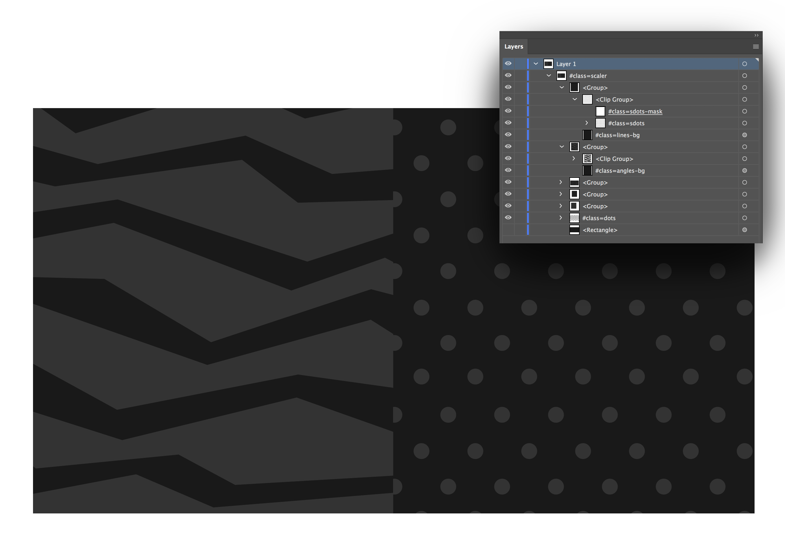
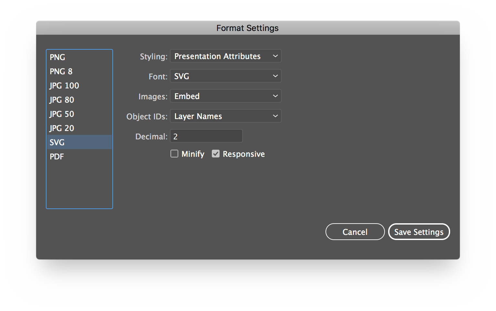

# Parallax SVG Animation Tools

A simple set of python functions to help working with animated SVGs exported from Illustrator. More features coming soon!
We used it to create animations like this.


[Viva La Velo](https://parall.ax/viva-le-velo)


## Overview

Part of animating with SVGs is getting references to elements in code and passing them to animation functions. For complicated animations this becomes difficult and hand editing SVG code is slow and gets overwritten when your artwork updates. We decided to write a post-processer for SVGs produced by Illustrator to help speed this up. Layer names are used to create attributes, classes and ID's making selecting them in JS or CSS far easier.





## Quick Example

First create an Illustrator file, add an element and change its layer name to say `#class=my-element`. Export the SVG using the **File > Export > Export for Screens** option with the following settings.





Download the [svg tools]() and unzip them into your project folder. 
Create a text file called `process_svg.py` (or whatever you want) with the following code.

```
from svg_tools import *

compile_svg('animation.svg', 'processed_animation.svg', 
{
	'process_layer_names': True
})

inline_svg('animation.html', 'index.html')

```

Create a HTML file as below. This will pull in SVGs so we don't need to copy-paste anything.


```
<!DOCTYPE html>
<html>
<head>
	<meta charset='utf-8'/>
</head>
<body>

//import processed_animation.svg

</body>
</html>
```

Open the command line and navigate to your project folder. Call the script using `python process_svg.py`. You should see a list of processed files (or just one in this case) printed to the console if everything worked correctly.

You should now have a HTML file with your processed SVG in it. All that is left to do is animate it with your tool of choice (ours is [GSAP](https://greensock.com/)).


## Functions

### process\_svg(src\_path, dst\_path, options)
Processes a single SVG and places it in the supplied destination directory. The following options are available.

+ **process\_layer\_names:**
Converts layer names as defined in Illustator into attributes. Begin the layer name with a '#' to indicate the layer should be parsed. 
For example `#id=my-id, class=my-class my-other-class, role=my-role` ...etc.
This is useful for fetching elements with Javascript as well as marking up elements for accessibility - see this [CSS Tricks Accessible SVG ](https://css-tricks.com/accessible-svgs/) article.
You can also use `origin=100 100` to set origins for rotating/scaling with GSAP (expands to data-svg-origin). 
NOTE: Requires using commas to separate the attributes as that makes the parsing code a lot simpler :)

+ **namespace:** 
Appends a namespace to classes and IDs if one is provided. Useful for avoiding conflicts with other SVG files for things like masks and clipPaths.

+ **nowhitespace:**
Removes unneeded whitespace. We don't do anything fancier than that so as to not break animations. Use the excellent [SVGO](<https://github.com/svg/svgo>) if you need better minification.

+ **attributes:**
An object of key:value strings that will be applied as attributes to the root SVG element.


### inline\_svg(src\_path, dst\_path)
In order to animate SVGs code needs to be placed in-line. This function will look at the source HTML and include any references defined by `//import` statements to SVGs that it finds.